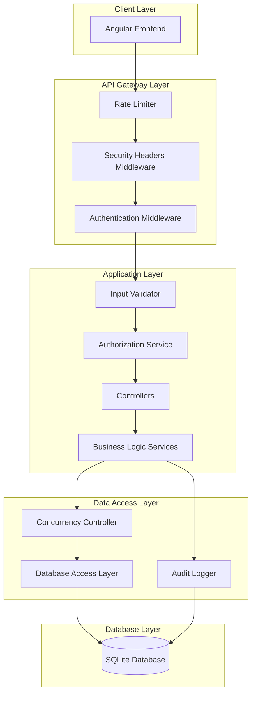
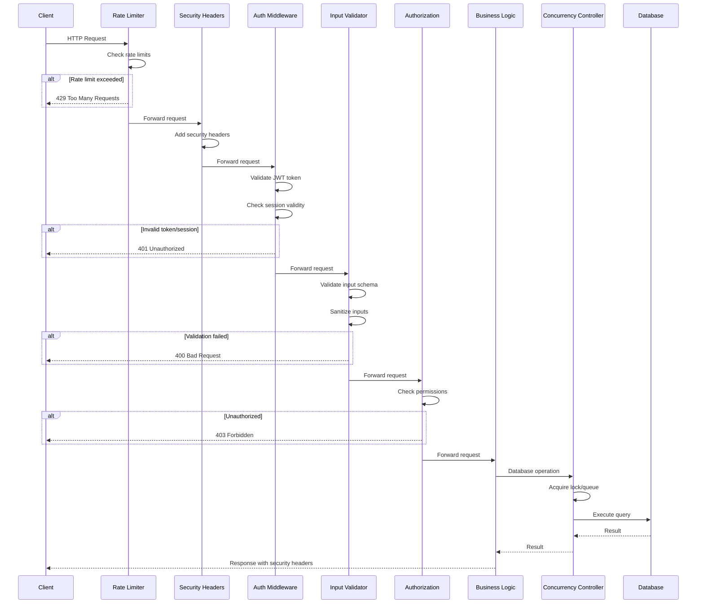

# Design Document: Security and Architecture Improvements

## Overview

This design document outlines the technical implementation for comprehensive security hardening and architecture improvements for the Robigoo Field Sprayer Control Station. The design addresses SQL injection prevention, session management fixes, database concurrency control, and server-side refactoring to create a state-of-the-art secure application.

The implementation follows defense-in-depth principles, implementing multiple layers of security controls to protect against various attack vectors while maintaining application performance and usability.

## Architecture

### High-Level Architecture



### Request Processing Flow



## Components and Interfaces

### 1. Input Validation Service

```csharp
public interface IInputValidationService
{
    ValidationResult ValidateAndSanitize<T>(T input) where T : class;
    string SanitizeString(string input, int maxLength);
    bool IsValidEmail(string email);
    bool IsValidPhoneNumber(string phone);
    bool ContainsSqlInjectionPatterns(string input);
}

public class ValidationResult
{
    public bool IsValid { get; set; }
    public List<ValidationError> Errors { get; set; }
}

public class ValidationError
{
    public string Field { get; set; }
    public string Message { get; set; }
    public string Code { get; set; }
}
```

### 2. Session Management Service

```csharp
public interface ISessionManagementService
{
    Task<SessionCheckResult> CheckExistingSessionsAsync(long userId);
    Task<UserSession> CreateSessionAsync(long userId, string accessToken, string refreshToken, string ipAddress, string userAgent);
    Task InvalidateSessionAsync(string sessionToken);
    Task InvalidateAllUserSessionsAsync(long userId);
    Task CleanupExpiredSessionsAsync();
    Task<bool> IsSessionValidAsync(string sessionToken);
}

public class SessionCheckResult
{
    public bool HasActiveSession { get; set; }
    public UserSession ExistingSession { get; set; }
    public bool RequiresForceLogin { get; set; }
}
```

### 3. Concurrency Controller

```csharp
public interface IConcurrencyController
{
    Task<T> ExecuteWithLockAsync<T>(string resourceKey, Func<Task<T>> operation, TimeSpan timeout);
    Task EnqueueWriteOperationAsync(string entityType, string entityId, Func<Task> operation);
    Task<ConcurrencyResult<T>> ExecuteWithOptimisticConcurrencyAsync<T>(Func<Task<T>> operation) where T : class;
}

public class ConcurrencyResult<T>
{
    public bool Success { get; set; }
    public T Result { get; set; }
    public ConcurrencyConflict Conflict { get; set; }
}

public class ConcurrencyConflict
{
    public string EntityType { get; set; }
    public string EntityId { get; set; }
    public DateTime ConflictTime { get; set; }
    public string Message { get; set; }
}
```

### 4. Database Write Queue

```csharp
public interface IDatabaseWriteQueue
{
    Task<QueuedOperationResult> EnqueueAsync(WriteOperation operation);
    Task<int> GetQueueLengthAsync();
    Task<QueuePosition> GetPositionAsync(string operationId);
}

public class WriteOperation
{
    public string Id { get; set; }
    public string EntityType { get; set; }
    public string EntityId { get; set; }
    public Func<Task> Operation { get; set; }
    public DateTime EnqueuedAt { get; set; }
    public TimeSpan Timeout { get; set; }
}

public class QueuedOperationResult
{
    public string OperationId { get; set; }
    public int QueuePosition { get; set; }
    public TimeSpan EstimatedWaitTime { get; set; }
}
```

### 5. Security Audit Service (Enhanced)

```csharp
public interface ISecurityAuditService
{
    Task LogLoginAttemptAsync(string login, string ipAddress, string userAgent, bool success, string failureReason = null);
    Task LogAuthorizationFailureAsync(long userId, string resource, string action);
    Task LogDataAccessAsync(long userId, string entityType, string entityId, string action);
    Task LogSecurityEventAsync(SecurityEventType eventType, string details, string ipAddress);
    Task<bool> IsLockedOutAsync(string login, string ipAddress);
    Task<int> GetFailedAttemptsCountAsync(string login, TimeSpan window);
}

public enum SecurityEventType
{
    SqlInjectionAttempt,
    RateLimitExceeded,
    InvalidTokenUsed,
    PrivilegeEscalationAttempt,
    SuspiciousActivity
}
```

### 6. Authorization Service (Enhanced)

```csharp
public interface IAuthorizationService
{
    Task<bool> CanAccessResourceAsync(long userId, string resourceType, string resourceId, string action);
    Task<bool> IsAdminAsync(long userId);
    Task<bool> CanModifyUserAsync(long requestingUserId, long targetUserId);
    Task<bool> CanDeleteUserAsync(long requestingUserId, long targetUserId);
    void ValidateRoleChange(string currentRole, string newRole, bool isMasterAdmin);
}
```

## Data Models

### Enhanced Entity Models with Concurrency Support

```csharp
public abstract class BaseEntity
{
    public DateTime CreatedAt { get; set; }
    public DateTime? UpdatedAt { get; set; }
    
    // Optimistic concurrency token
    [Timestamp]
    public byte[] RowVersion { get; set; }
}

public class CropSprayer : BaseEntity
{
    [Key]
    [MaxLength(100)]
    public string SerialNumber { get; set; }
    
    [Required]
    [MaxLength(200)]
    public string SprayerName { get; set; }
    
    // ... other properties with validation attributes
}

public class InspectionProtocol : BaseEntity
{
    public long Id { get; set; }
    
    [Required]
    [MaxLength(50)]
    public string ProtocolNumber { get; set; }
    
    // Concurrency version for conflict detection
    public int Version { get; set; }
    
    // ... other properties
}
```

### Session Model Enhancement

```csharp
public class UserSession
{
    public long Id { get; set; }
    public long UserId { get; set; }
    
    [MaxLength(2000)]
    public string SessionToken { get; set; }
    
    [MaxLength(256)]
    public string RefreshToken { get; set; }
    
    public DateTime? RefreshTokenExpiresAt { get; set; }
    public DateTime CreatedAt { get; set; }
    public DateTime LastActivityAt { get; set; }
    public bool IsActive { get; set; }
    
    [MaxLength(50)]
    public string IpAddress { get; set; }
    
    [MaxLength(500)]
    public string UserAgent { get; set; }
    
    // New: Session timeout configuration
    public int? SessionTimeoutMinutes { get; set; }
    
    // New: Explicit invalidation tracking
    public DateTime? InvalidatedAt { get; set; }
    public string InvalidationReason { get; set; }
    
    public User User { get; set; }
}
```

### Security Event Log Model

```csharp
public class SecurityEventLog
{
    public long Id { get; set; }
    
    [Required]
    public SecurityEventType EventType { get; set; }
    
    [MaxLength(500)]
    public string Details { get; set; }
    
    [MaxLength(50)]
    public string IpAddress { get; set; }
    
    public long? UserId { get; set; }
    
    [MaxLength(500)]
    public string UserAgent { get; set; }
    
    public DateTime OccurredAt { get; set; }
    
    [MaxLength(100)]
    public string CorrelationId { get; set; }
}
```

### Database Context Enhancement

```csharp
public class AppDbContext : DbContext
{
    // Existing DbSets...
    
    public DbSet<SecurityEventLog> SecurityEventLogs { get; set; }
    
    protected override void OnModelCreating(ModelBuilder modelBuilder)
    {
        base.OnModelCreating(modelBuilder);
        
        // Configure optimistic concurrency
        modelBuilder.Entity<CropSprayer>()
            .Property(e => e.RowVersion)
            .IsRowVersion();
            
        modelBuilder.Entity<InspectionProtocol>()
            .Property(e => e.RowVersion)
            .IsRowVersion();
            
        // Configure indexes for security queries
        modelBuilder.Entity<SecurityEventLog>()
            .HasIndex(e => e.OccurredAt);
            
        modelBuilder.Entity<SecurityEventLog>()
            .HasIndex(e => new { e.EventType, e.OccurredAt });
            
        modelBuilder.Entity<UserSession>()
            .HasIndex(e => new { e.UserId, e.IsActive });
    }
    
    public override async Task<int> SaveChangesAsync(CancellationToken cancellationToken = default)
    {
        try
        {
            return await base.SaveChangesAsync(cancellationToken);
        }
        catch (DbUpdateConcurrencyException ex)
        {
            // Handle concurrency conflicts
            throw new ConcurrencyException("The record was modified by another user.", ex);
        }
    }
}
```

## SQL Injection Prevention Implementation

### Parameterized Query Patterns

```csharp
// CORRECT: Using LINQ (Entity Framework handles parameterization)
public async Task<List<CropSprayer>> SearchCropSprayersAsync(string searchTerm)
{
    var sanitizedTerm = _inputValidator.SanitizeString(searchTerm, 100);
    
    return await _context.CropSprayers
        .Where(cs => cs.SerialNumber.Contains(sanitizedTerm) ||
                     cs.SprayerName.Contains(sanitizedTerm))
        .ToListAsync();
}

// CORRECT: Using parameterized raw SQL when needed
public async Task<int> GetCountByTypeAsync(string type)
{
    var sanitizedType = _inputValidator.SanitizeString(type, 10);
    
    return await _context.Database
        .ExecuteSqlRawAsync(
            "SELECT COUNT(*) FROM Machines WHERE Type = {0}",
            sanitizedType);
}

// FORBIDDEN: Never do this
// var query = $"SELECT * FROM Machines WHERE Type = '{type}'";
```

### Input Validation Patterns

```csharp
public class SqlInjectionDetector
{
    private static readonly string[] DangerousPatterns = new[]
    {
        "--", ";--", "/*", "*/", "@@", "@",
        "char(", "nchar(", "varchar(", "nvarchar(",
        "alter", "begin", "cast", "create", "cursor",
        "declare", "delete", "drop", "end", "exec",
        "execute", "fetch", "insert", "kill", "select",
        "sys", "sysobjects", "syscolumns", "table", "update"
    };
    
    public bool ContainsSqlInjectionPatterns(string input)
    {
        if (string.IsNullOrEmpty(input)) return false;
        
        var lowerInput = input.ToLowerInvariant();
        return DangerousPatterns.Any(pattern => 
            lowerInput.Contains(pattern));
    }
}
```

## Session Management Fix Implementation

### Session Check Logic

```csharp
public class SessionManagementService : ISessionManagementService
{
    public async Task<SessionCheckResult> CheckExistingSessionsAsync(long userId)
    {
        var now = DateTime.UtcNow;
        
        // Find truly active sessions (not expired, not invalidated)
        var activeSession = await _context.UserSessions
            .Where(s => s.UserId == userId && 
                        s.IsActive && 
                        s.InvalidatedAt == null &&
                        (s.RefreshTokenExpiresAt == null || s.RefreshTokenExpiresAt > now))
            .OrderByDescending(s => s.LastActivityAt)
            .FirstOrDefaultAsync();
        
        if (activeSession == null)
        {
            return new SessionCheckResult
            {
                HasActiveSession = false,
                RequiresForceLogin = false
            };
        }
        
        // Check if session has timed out due to inactivity
        var timeoutMinutes = activeSession.SessionTimeoutMinutes ?? 30;
        var sessionTimeout = activeSession.LastActivityAt.AddMinutes(timeoutMinutes);
        
        if (now > sessionTimeout)
        {
            // Session has timed out - mark as inactive
            activeSession.IsActive = false;
            activeSession.InvalidatedAt = now;
            activeSession.InvalidationReason = "Session timeout";
            await _context.SaveChangesAsync();
            
            return new SessionCheckResult
            {
                HasActiveSession = false,
                RequiresForceLogin = false
            };
        }
        
        return new SessionCheckResult
        {
            HasActiveSession = true,
            ExistingSession = activeSession,
            RequiresForceLogin = true
        };
    }
}
```

## Database Concurrency Implementation

### Optimistic Concurrency with SQLite

```csharp
public class ConcurrencyController : IConcurrencyController
{
    private readonly SemaphoreSlim _writeLock = new SemaphoreSlim(1, 1);
    private readonly ConcurrentDictionary<string, SemaphoreSlim> _entityLocks = new();
    
    public async Task<ConcurrencyResult<T>> ExecuteWithOptimisticConcurrencyAsync<T>(
        Func<Task<T>> operation) where T : class
    {
        const int maxRetries = 3;
        var delay = TimeSpan.FromMilliseconds(100);
        
        for (int attempt = 0; attempt < maxRetries; attempt++)
        {
            try
            {
                var result = await operation();
                return new ConcurrencyResult<T>
                {
                    Success = true,
                    Result = result
                };
            }
            catch (DbUpdateConcurrencyException ex)
            {
                if (attempt == maxRetries - 1)
                {
                    return new ConcurrencyResult<T>
                    {
                        Success = false,
                        Conflict = new ConcurrencyConflict
                        {
                            Message = "The record was modified by another user. Please refresh and try again.",
                            ConflictTime = DateTime.UtcNow
                        }
                    };
                }
                
                // Exponential backoff
                await Task.Delay(delay);
                delay = TimeSpan.FromMilliseconds(delay.TotalMilliseconds * 2);
            }
        }
        
        return new ConcurrencyResult<T> { Success = false };
    }
    
    public async Task<T> ExecuteWithLockAsync<T>(
        string resourceKey, 
        Func<Task<T>> operation, 
        TimeSpan timeout)
    {
        var entityLock = _entityLocks.GetOrAdd(resourceKey, _ => new SemaphoreSlim(1, 1));
        
        if (!await entityLock.WaitAsync(timeout))
        {
            throw new TimeoutException($"Could not acquire lock for {resourceKey} within {timeout}");
        }
        
        try
        {
            return await operation();
        }
        finally
        {
            entityLock.Release();
        }
    }
}
```

### Write Queue Implementation

```csharp
public class DatabaseWriteQueue : IDatabaseWriteQueue, IHostedService
{
    private readonly Channel<WriteOperation> _queue;
    private readonly IServiceScopeFactory _scopeFactory;
    private readonly ILogger<DatabaseWriteQueue> _logger;
    private Task _processingTask;
    private CancellationTokenSource _cts;
    
    public DatabaseWriteQueue(IServiceScopeFactory scopeFactory, ILogger<DatabaseWriteQueue> logger)
    {
        _scopeFactory = scopeFactory;
        _logger = logger;
        _queue = Channel.CreateBounded<WriteOperation>(new BoundedChannelOptions(100)
        {
            FullMode = BoundedChannelFullMode.Wait
        });
    }
    
    public async Task<QueuedOperationResult> EnqueueAsync(WriteOperation operation)
    {
        operation.Id = Guid.NewGuid().ToString();
        operation.EnqueuedAt = DateTime.UtcNow;
        
        if (!await _queue.Writer.TryWriteAsync(operation))
        {
            throw new ServiceUnavailableException("Write queue is full. Please try again later.");
        }
        
        return new QueuedOperationResult
        {
            OperationId = operation.Id,
            QueuePosition = _queue.Reader.Count
        };
    }
    
    public Task StartAsync(CancellationToken cancellationToken)
    {
        _cts = CancellationTokenSource.CreateLinkedTokenSource(cancellationToken);
        _processingTask = ProcessQueueAsync(_cts.Token);
        return Task.CompletedTask;
    }
    
    private async Task ProcessQueueAsync(CancellationToken cancellationToken)
    {
        await foreach (var operation in _queue.Reader.ReadAllAsync(cancellationToken))
        {
            try
            {
                using var scope = _scopeFactory.CreateScope();
                using var timeoutCts = new CancellationTokenSource(operation.Timeout);
                
                await operation.Operation();
                
                _logger.LogInformation("Processed write operation {OperationId} for {EntityType}/{EntityId}",
                    operation.Id, operation.EntityType, operation.EntityId);
            }
            catch (Exception ex)
            {
                _logger.LogError(ex, "Failed to process write operation {OperationId}", operation.Id);
            }
        }
    }
    
    public Task StopAsync(CancellationToken cancellationToken)
    {
        _cts?.Cancel();
        return _processingTask ?? Task.CompletedTask;
    }
}
```

## Server-Side Validation Implementation

### Validation Attributes and Service

```csharp
public class InputValidationService : IInputValidationService
{
    private readonly SqlInjectionDetector _sqlDetector;
    
    public ValidationResult ValidateAndSanitize<T>(T input) where T : class
    {
        var result = new ValidationResult { IsValid = true, Errors = new List<ValidationError>() };
        var properties = typeof(T).GetProperties();
        
        foreach (var prop in properties)
        {
            var value = prop.GetValue(input);
            
            // Check string properties for SQL injection
            if (value is string strValue && !string.IsNullOrEmpty(strValue))
            {
                if (_sqlDetector.ContainsSqlInjectionPatterns(strValue))
                {
                    result.IsValid = false;
                    result.Errors.Add(new ValidationError
                    {
                        Field = prop.Name,
                        Message = "Input contains invalid characters",
                        Code = "INVALID_INPUT"
                    });
                }
                
                // Check max length
                var maxLengthAttr = prop.GetCustomAttribute<MaxLengthAttribute>();
                if (maxLengthAttr != null && strValue.Length > maxLengthAttr.Length)
                {
                    result.IsValid = false;
                    result.Errors.Add(new ValidationError
                    {
                        Field = prop.Name,
                        Message = $"Maximum length is {maxLengthAttr.Length} characters",
                        Code = "MAX_LENGTH_EXCEEDED"
                    });
                }
            }
            
            // Validate required fields
            var requiredAttr = prop.GetCustomAttribute<RequiredAttribute>();
            if (requiredAttr != null && (value == null || (value is string s && string.IsNullOrWhiteSpace(s))))
            {
                result.IsValid = false;
                result.Errors.Add(new ValidationError
                {
                    Field = prop.Name,
                    Message = "This field is required",
                    Code = "REQUIRED"
                });
            }
        }
        
        return result;
    }
    
    public string SanitizeString(string input, int maxLength)
    {
        if (string.IsNullOrEmpty(input)) return input;
        
        // Trim and limit length
        var sanitized = input.Trim();
        if (sanitized.Length > maxLength)
        {
            sanitized = sanitized.Substring(0, maxLength);
        }
        
        // Encode HTML entities to prevent XSS
        sanitized = System.Web.HttpUtility.HtmlEncode(sanitized);
        
        return sanitized;
    }
    
    public bool IsValidEmail(string email)
    {
        if (string.IsNullOrWhiteSpace(email)) return false;
        
        try
        {
            var addr = new System.Net.Mail.MailAddress(email);
            return addr.Address == email;
        }
        catch
        {
            return false;
        }
    }
}
```

## Error Handling Implementation

### Global Exception Handler

```csharp
public class GlobalExceptionHandler : IExceptionHandler
{
    private readonly ILogger<GlobalExceptionHandler> _logger;
    private readonly ISecurityAuditService _auditService;
    
    public async ValueTask<bool> TryHandleAsync(
        HttpContext httpContext,
        Exception exception,
        CancellationToken cancellationToken)
    {
        var correlationId = Guid.NewGuid().ToString();
        
        // Log full details server-side
        _logger.LogError(exception, 
            "Unhandled exception. CorrelationId: {CorrelationId}, Path: {Path}",
            correlationId, httpContext.Request.Path);
        
        // Determine response based on exception type
        var (statusCode, message) = exception switch
        {
            ValidationException => (400, "Invalid request data"),
            UnauthorizedAccessException => (401, "Authentication required"),
            ForbiddenException => (403, "Access denied"),
            NotFoundException => (404, "Resource not found"),
            ConcurrencyException => (409, "The resource was modified by another user"),
            ServiceUnavailableException => (503, "Service temporarily unavailable"),
            _ => (500, "An unexpected error occurred")
        };
        
        // Log security events
        if (exception is SecurityException secEx)
        {
            await _auditService.LogSecurityEventAsync(
                SecurityEventType.SuspiciousActivity,
                secEx.Message,
                httpContext.Connection.RemoteIpAddress?.ToString());
        }
        
        // Return safe response to client
        httpContext.Response.StatusCode = statusCode;
        await httpContext.Response.WriteAsJsonAsync(new
        {
            error = message,
            correlationId = correlationId,
            timestamp = DateTime.UtcNow
        }, cancellationToken);
        
        return true;
    }
}
```


## Correctness Properties

*A property is a characteristic or behavior that should hold true across all valid executions of a system—essentially, a formal statement about what the system should do. Properties serve as the bridge between human-readable specifications and machine-verifiable correctness guarantees.*

### Property 1: SQL Injection Prevention

*For any* user input string containing SQL injection patterns (such as `'; DROP TABLE`, `OR 1=1`, `UNION SELECT`), the Input_Validator SHALL reject the input and the database query SHALL NOT be affected by the malicious content.

**Validates: Requirements 1.3, 1.4, 1.6**

### Property 2: Input String Sanitization

*For any* string input, after sanitization the output SHALL have length less than or equal to the configured maximum, SHALL have HTML/script tags encoded or removed, and SHALL not contain unescaped special characters.

**Validates: Requirements 2.2, 2.6**

### Property 3: Email and Phone Validation

*For any* email string, the Input_Validator SHALL return true if and only if the string conforms to RFC 5322 email format. *For any* phone string, the Input_Validator SHALL return true if and only if the string matches the expected phone format pattern.

**Validates: Requirements 2.3, 2.4**

### Property 4: Numeric Range Validation

*For any* numeric input and configured range [min, max], the Input_Validator SHALL accept the input if and only if min ≤ input ≤ max.

**Validates: Requirements 2.5**

### Property 5: Validation Error Response

*For any* invalid API request payload, the Backend SHALL return HTTP 400 with a response body containing specific field-level validation error messages.

**Validates: Requirements 2.1, 2.7**

### Property 6: Session Conflict Detection Accuracy

*For any* user login attempt, the Session_Manager SHALL return a conflict indication if and only if there exists an active session for that user where: IsActive is true, InvalidatedAt is null, and RefreshTokenExpiresAt is in the future.

**Validates: Requirements 3.1, 3.2, 3.3**

### Property 7: Session Invalidation on Logout

*For any* logout operation, after completion the session record SHALL have IsActive set to false and InvalidatedAt set to the current timestamp.

**Validates: Requirements 3.4**

### Property 8: Expired Session Cleanup

*For any* session where either the refresh token has expired OR the last activity exceeds the configured timeout, the Session_Manager SHALL mark the session as inactive and exclude it from active session checks.

**Validates: Requirements 3.5, 3.6, 3.7**

### Property 9: Optimistic Concurrency Conflict Detection

*For any* two concurrent modifications to the same entity, if both read the same row version and attempt to save, exactly one SHALL succeed and the other SHALL receive a concurrency conflict error.

**Validates: Requirements 4.1, 4.2, 4.3**

### Property 10: Transaction Atomicity

*For any* operation involving multiple related records, if any part of the operation fails, all changes SHALL be rolled back and the database SHALL remain in its pre-operation state.

**Validates: Requirements 4.4**

### Property 11: Retry with Exponential Backoff

*For any* transient database failure, the Concurrency_Controller SHALL retry the operation with delays that increase exponentially (e.g., 100ms, 200ms, 400ms) up to a maximum retry count.

**Validates: Requirements 4.5**

### Property 12: Write Queue Ordering

*For any* sequence of write operations submitted to the queue for the same entity, the operations SHALL be processed in the order they were submitted (FIFO).

**Validates: Requirements 5.1, 5.2**

### Property 13: Queue Failure Isolation

*For any* failed queued operation, subsequent operations in the queue SHALL continue to be processed without blocking.

**Validates: Requirements 5.4**

### Property 14: Queue Operation Timeout

*For any* queued operation with a configured timeout, if the operation does not complete within the timeout period, it SHALL be cancelled and an error SHALL be returned to the client.

**Validates: Requirements 5.5**

### Property 15: Protocol Number Generation

*For any* inspection protocol creation, the protocol number SHALL be generated server-side following the pattern `SKO/{year}/{sequence}` where sequence is monotonically increasing within each year.

**Validates: Requirements 6.3**

### Property 16: Server-Side Constraint Enforcement

*For any* API request that violates field constraints or business rules, the Backend SHALL reject the request with appropriate error details regardless of any client-side validation.

**Validates: Requirements 6.2, 6.4**

### Property 17: File Upload Validation

*For any* file upload, the Backend SHALL validate: file size is within configured limits, content type matches allowed types, and file content matches the declared type (magic bytes validation).

**Validates: Requirements 6.6**

### Property 18: Account Lockout

*For any* user account, after N consecutive failed login attempts (where N is configurable), subsequent login attempts SHALL be rejected until the lockout period expires.

**Validates: Requirements 7.1**

### Property 19: Authentication Logging

*For any* authentication attempt (successful or failed), the Authentication_Service SHALL create a log entry containing: username, IP address, user agent, timestamp, and success/failure status.

**Validates: Requirements 7.2**

### Property 20: Generic Lockout Error

*For any* locked account attempting login, the error response SHALL be indistinguishable from an invalid credentials error (no information leakage about lockout status).

**Validates: Requirements 7.3**

### Property 21: Token Validation

*For any* API request with a JWT token, the Backend SHALL reject the request with 401 Unauthorized if: the token signature is invalid, the token is expired, OR the associated session is inactive.

**Validates: Requirements 7.5, 7.6**

### Property 22: Refresh Token Rotation

*For any* refresh token usage, the Authentication_Service SHALL issue a new refresh token and invalidate the old one, such that the old token cannot be used again.

**Validates: Requirements 7.7**

### Property 23: Role-Based Access Control

*For any* protected API endpoint requiring admin role, requests from non-admin users SHALL receive HTTP 403 Forbidden.

**Validates: Requirements 8.1, 8.2**

### Property 24: Resource Ownership Authorization

*For any* resource with an owner, non-admin users SHALL only be able to access/modify resources they own.

**Validates: Requirements 8.3, 8.4**

### Property 25: Privilege Escalation Prevention

*For any* role change request, the Backend SHALL reject attempts by non-master-admin users to grant admin privileges.

**Validates: Requirements 8.6**

### Property 26: Authorization Failure Logging

*For any* authorization failure, the Backend SHALL log the attempt with: user ID, requested resource, requested action, and timestamp.

**Validates: Requirements 8.7**

### Property 27: Safe Error Responses

*For any* error response returned to clients, the response body SHALL NOT contain: stack traces, internal file paths, database connection strings, or other internal system details.

**Validates: Requirements 9.2, 11.1, 11.3**

### Property 28: BCrypt Password Hashing

*For any* password stored in the database, the hash SHALL be in BCrypt format with a work factor of at least 12.

**Validates: Requirements 9.4**

### Property 29: Audit Trail Completeness

*For any* data modification (create, update, delete), the Backend SHALL create an audit log entry with: entity type, entity ID, user who made the change, timestamp, and description of changes.

**Validates: Requirements 9.6**

### Property 30: Security Headers Presence

*For any* HTTP response, the Backend SHALL include: Content-Security-Policy, X-Content-Type-Options: nosniff, X-Frame-Options: DENY, and Cache-Control headers for sensitive endpoints.

**Validates: Requirements 10.1, 10.2, 10.3, 10.7**

### Property 31: CORS Restriction

*For any* cross-origin request in production mode, the Backend SHALL only allow requests from configured allowed origins.

**Validates: Requirements 10.5**

### Property 32: Correlation ID Tracing

*For any* request, the Backend SHALL generate a correlation ID that appears in both the response and server-side logs for request tracing.

**Validates: Requirements 11.4**

### Property 33: Log Injection Prevention

*For any* user input that appears in logs, the input SHALL be sanitized to prevent log injection attacks (newlines, control characters removed/escaped).

**Validates: Requirements 11.7**

### Property 34: Rate Limiting Enforcement

*For any* client exceeding the configured rate limit for an endpoint, the Backend SHALL return HTTP 429 Too Many Requests with a Retry-After header indicating when the client can retry.

**Validates: Requirements 12.1, 12.3**

### Property 35: Per-User Rate Limiting

*For any* authenticated user, rate limits SHALL be enforced per-user in addition to per-IP, such that a single user cannot exhaust the rate limit for other users sharing the same IP.

**Validates: Requirements 12.2**

### Property 36: Rate Limit Violation Logging

*For any* rate limit violation, the Backend SHALL log the event with: source IP, user ID (if authenticated), endpoint, and timestamp.

**Validates: Requirements 12.7**

## Error Handling

### Error Response Format

All error responses follow a consistent format:

```json
{
  "error": "Human-readable error message",
  "code": "ERROR_CODE",
  "correlationId": "uuid-for-tracing",
  "timestamp": "2025-01-15T10:30:00Z",
  "details": [
    {
      "field": "fieldName",
      "message": "Specific validation error"
    }
  ]
}
```

### HTTP Status Code Mapping

| Status Code | Scenario |
|-------------|----------|
| 400 | Validation errors, malformed requests |
| 401 | Missing/invalid/expired authentication |
| 403 | Insufficient permissions |
| 404 | Resource not found |
| 409 | Concurrency conflict |
| 429 | Rate limit exceeded |
| 500 | Internal server error (generic message to client) |
| 503 | Service unavailable (queue full, maintenance) |

### Exception Hierarchy

```csharp
public abstract class RobigooException : Exception
{
    public string Code { get; }
    public string CorrelationId { get; }
}

public class ValidationException : RobigooException { }
public class AuthenticationException : RobigooException { }
public class AuthorizationException : RobigooException { }
public class ConcurrencyException : RobigooException { }
public class NotFoundException : RobigooException { }
public class RateLimitException : RobigooException { }
public class ServiceUnavailableException : RobigooException { }
public class SecurityException : RobigooException { }
```

## Testing Strategy

### Dual Testing Approach

This implementation requires both unit tests and property-based tests for comprehensive coverage:

- **Unit tests**: Verify specific examples, edge cases, integration points, and error conditions
- **Property tests**: Verify universal properties across all valid inputs using randomized testing

### Property-Based Testing Configuration

- **Library**: FsCheck for .NET (C#)
- **Minimum iterations**: 100 per property test
- **Tag format**: `Feature: security-architecture-improvements, Property {number}: {property_text}`

### Test Categories

#### 1. Input Validation Tests
- Property tests for SQL injection pattern detection
- Property tests for string sanitization
- Property tests for email/phone validation
- Unit tests for specific edge cases (empty strings, unicode, etc.)

#### 2. Session Management Tests
- Property tests for session conflict detection accuracy
- Property tests for session expiration logic
- Unit tests for the specific bug scenario (no session exists)
- Integration tests for login/logout flow

#### 3. Concurrency Tests
- Property tests for optimistic concurrency conflict detection
- Property tests for write queue ordering
- Unit tests for timeout handling
- Integration tests for concurrent save scenarios

#### 4. Security Tests
- Property tests for authentication token validation
- Property tests for authorization enforcement
- Property tests for rate limiting behavior
- Unit tests for specific attack vectors

#### 5. Error Handling Tests
- Property tests for safe error response format
- Property tests for correlation ID presence
- Unit tests for specific exception types

### Test Data Generators

```csharp
// FsCheck generators for property-based testing
public static class SecurityGenerators
{
    public static Arbitrary<string> SqlInjectionPayload() =>
        Gen.Elements(
            "'; DROP TABLE Users; --",
            "' OR '1'='1",
            "1; DELETE FROM Users",
            "' UNION SELECT * FROM Users --",
            "admin'--",
            "1' AND '1'='1"
        ).ToArbitrary();
    
    public static Arbitrary<string> SafeString() =>
        Arb.Default.String()
            .Filter(s => s != null && !ContainsSqlPatterns(s));
    
    public static Arbitrary<string> ValidEmail() =>
        Gen.Elements(
            "user@example.com",
            "test.user@domain.org",
            "name+tag@company.co.uk"
        ).ToArbitrary();
    
    public static Arbitrary<string> InvalidEmail() =>
        Gen.Elements(
            "notanemail",
            "@nodomain.com",
            "spaces in@email.com",
            "missing@.com"
        ).ToArbitrary();
}
```

### Integration Test Scenarios

1. **Session Bug Fix Verification**
   - Login with no existing session → Should succeed without conflict dialog
   - Login with active session → Should show conflict dialog
   - Login with expired session → Should succeed without conflict dialog

2. **Concurrent Save Scenario**
   - Two users load same record
   - Both modify and save
   - First save succeeds, second gets 409 Conflict

3. **Rate Limiting Scenario**
   - Make requests up to limit → All succeed
   - Exceed limit → Get 429 with Retry-After
   - Wait for window → Requests succeed again
